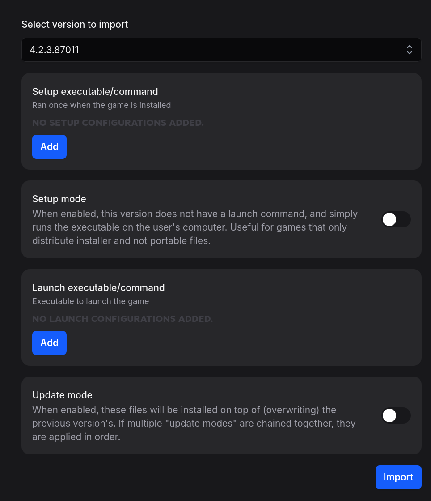

import { Steps } from "@astrojs/starlight/components";

Once you've got a library set up, and have imported a game, you can import a version for that game.

<Steps>
1. ### **Add your version files.**
    Following your library structure, copy over your version files to your version directory. Make sure you verify the game works, and you know how to launch it properly. 
2. ### **Open import wizard.**

    Head over to your Admin Dashboard, and click on the "Library" tab. Drop should detect that you have a new version to import. To open the import wizard, you can either click on the alert on any game tile, or click "Open in Editor" and navigate to the "Versions" tab.

3. ### **Select your version folder.**

   From the dropdown, select your version folder. It should load for a little bit, and give you an interface that looks something like this:

   

4. ### _About the wizard..._

   Here's what each section is about:

   ### Setup executable/command

   Setup executables are run after download but before first launch, and are useful for extracting files or setting necessary configuration.

   :::tip
   Both setup and launch command configurations may provide suggestions based on file extension. To view these suggestions, start typing or click the chevron in the text field.
   :::

   ### Setup mode

   Setup mode removes the requirement of at least one launch command. Useful for installer-only versions. Clients will never show a launch button, only a setup button.

   ### Launch executable/command

   Launch executables can be launched by the user. If multiple launch commands are configured, they will all be shown to the user on launch to pick from.

   :::note
   For a version to show up on a platform, **at least one launch command of that platform needs to be configured**, unless the version is in setup-only mode.
   :::

   ### Update mode

   Update mode is for when you're importing a patch. **You have to re-add the launch/setup commands, they are not preserved from previous versions.**

5. ### **Import your version.**

   There are many different kinds of imports, but for simplicity's sake, we'll do either a portable or installer version.

   ### Portable version

   A portable version can be launched from an executable. To import a portable game, add a launch command with the portable game executable.

   ### Installer version

   A installer version uses "setup mode". Enable the option, and then add the installer executable in setup commands.

   :::note
   Setup and launch commands are parsed in a cross-platform, POSIX style. It's not relevant for simple setups, but useful to know. Read more about it in [Command Parsing](/reference/command-parsing/).
   :::

6. ### **Wait for import.**

   Drop will redirect you to a task page about the import. A version import scales with the size of the version, since the import will read through every file in the version and generate checksums.

   :::note
   As with the game import, feel free to leave the import page while it's going, without worrying about it cancelling.
   :::

</Steps>
