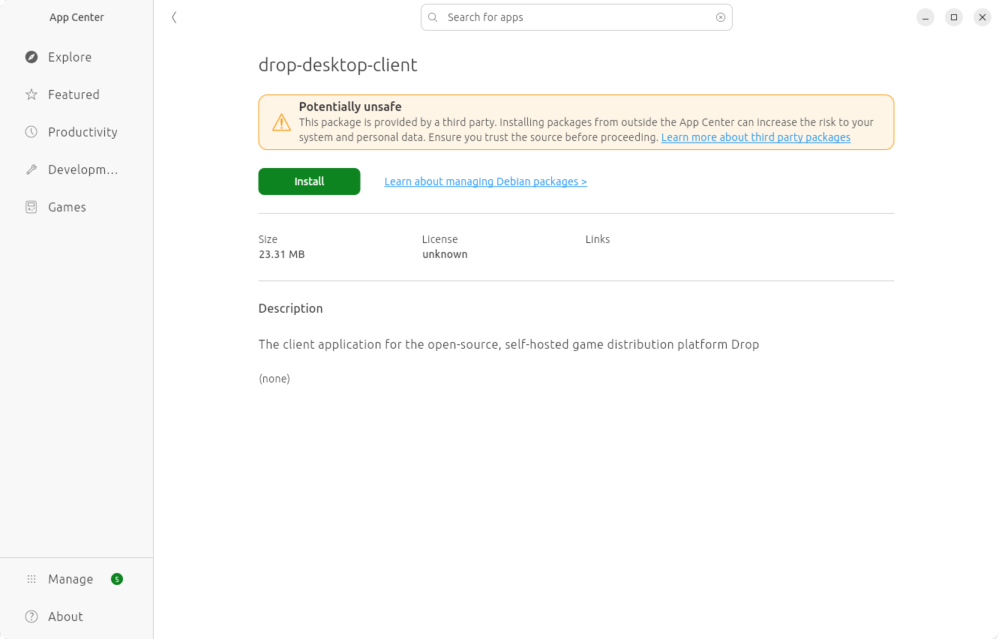

To install drop-app on Ubuntu, simply download the deb package and open the downloaded file.
It will open it in the App Center. You can click Install on this page.



## Uninstalling drop-app

To uninstall drop-app, you will need to open a terminal and run the following command:

```bash
sudo apt remove drop-desktop-client
```
